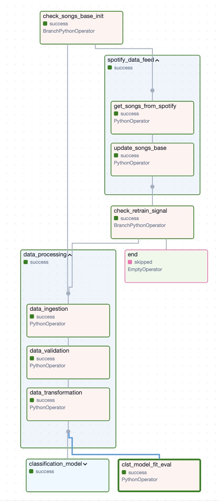

# Project Overview
### Design and Implementation of an MLOps CI/CD Pipeline for a Music Recommendation System

This project demonstrates the design and implementation of a Continuous Integration and Continuous Deployment (CI/CD) pipeline for a **Music Recommendation System** leveraging Spotify playlists.

Key components of the pipeline include:

- **CI/CD Pipeline Development**: Designed an automated pipeline for building, testing, and deploying the music recommendation system.
- **Pipeline Orchestration with Apache Airflow**: Configured and managed the orchestration of the pipeline using **Apache Airflow**, enabling automated, scalable, and efficient workflows.
- **Experiment Monitoring with MLflow & DagsHub**: Integrated **MLflow** for tracking machine learning experiments, model parameters, and performance metrics, with the MLflow server hosted on **DagsHub**.
- **Containerization with Docker**: Dockerized both the recommendation application and the pipeline orchestration to ensure portability, scalability, and consistency across environments.

## Project Architecture

```bash
.
├── config/
├── dags/
│   ├── custom_logger.py
│   ├── dag_data_feeding.py
│   ├── dag_utils.py
│   │   
├── logs/
│   │        
│   └── logs.log
│
├── mlops_msr
│   │  
│   ├── data/
│   │   ├── interim/
│   │   │   
│   │   ├── models_best/
│   │   │   
│   │   ├── new/
│   │   │   
│   │   ├── processed/
│   │   │   ├── X_test.csv
│   │   │   ├── X_train.csv
│   │   │   ├── playlist_df.csv
│   │   │   ├── y_test.csv
│   │   │   └── y_train.csv
│   │   │
│   │   ├── raw/
│   │   │   ├── data_feeding.log
│   │   │   ├── dataset.csv
│   │   │   ├── dataset.zip
│   │   │   ├── playlists.json
│   │   │   ├── retrain.log
│   │   │   ├── retrain_logs.log
│   │   │   ├── song_df.csv
│   │   │   │
│   │   ├── reco/
│   │   │   └── recommendation_data.json
│   │   ├── to_rec/
│   │   │   ├── genres.txt
│   │   │   ├── to_rec_0.csv
│   │   │   ├── to_rec_1.csv
│   │   │   ├── to_rec_2.csv
│   │   │   ├── to_rec_3.csv
│   │   │   ├── to_rec_4.csv
│   │   │   ├── to_rec_5.csv
│   │   │   ├── to_rec_6.csv
│   │   │   ├── to_rec_7.csv
│   │   │   ├── to_rec_8.csv
│   │   │   └── to_rec_9.csv
│   │   ├── uris/
│   │   └── status.txt
│   ├── images/
│   │   └── cosine_s.jpg
│   ├── logs/
│   │   └── logs.log
│   ├── metrics.
│   │   
│   ├── mlruns/
│   │   
│   ├── models/
│   │   
│   ├── models_best/
│   │   
│   ├── notebooks/
│   │ 
│   ├── shell_scripts_dk/
│   │   ├── run_data_feeding.sh
│   │   └── run_pipe.sh
│   │ 
│   ├── src/
│   │   │
│   │   ├── app/
│   │   │   │   
│   │   │   ├── logs
│   │   │   ├── static
│   │   │   ├── templates
│   │   │   ├── app.py
│   │   │   ├── app_utils.py
│   │   │   └── reco_monitoring.py
│   │   │   
│   │   ├── data_module_def/
│   │   │   ├── __pycache__
│   │   │   ├── __init__.py
│   │   │   ├── data_ingestion.py
│   │   │   ├── data_transformation.py
│   │   │   ├── data_validation.py
│   │   │   └── schema.yaml
│   │   │   
│   │   ├── models_module_def/
│   │   │   ├── __pycache__
│   │   │   ├── __init__.py
│   │   │   ├── model_evaluation.py
│   │   │   ├── model_trainer.py
│   │   │   ├── params.yaml
│   │   │   └── unsmodel_fit.py
│   │   │   
│   │   ├── pipeline_steps/
│   │   │   ├── __pycache__
│   │   │   ├── __init__.py
│   │   │   ├── prediction.py
│   │   │   ├── prediction_old_nogit.py
│   │   │   ├── stage01_data_ingestion.py
│   │   │   ├── stage02_data_validation.py
│   │   │   ├── stage03_data_transformation.py
│   │   │   ├── stage04_model_trainer.py
│   │   │   ├── stage05_model_evaluation.py
│   │   │   └── stage06_uns_model_fit_eval.py
│   │   │
│   │   ├── __init__.py
│   │   ├── common_utils.py
│   │   ├── config.py
│   │   ├── config.yaml
│   │   ├── config_manager.py
│   │   ├── data_feeding.py
│   │   ├── entity.py
│   │   └─ launch_retrain.py
│   │
│   ├── users/
│   │   └── users.json
│   │ 
│   ├── Dockerfile
│   ├── __init__.py
│   ├── app_requirements.txt
│   ├── custom_logger.py
│   ├── docker-compose.yaml
│   ├── dvc.lock
│   ├── dvc.yaml
│   └── main.py
│   
├── plugins/
│   
├── tests/
│
├── Dockerfile
├── README.md
├── __init__.py
├── air_requirements.txt
├── docker-compose.yaml
└── requirements.txt
```

## Setup

### 1. Clone the Repository
Start by cloning this repository to your local machine:

```bash
git clone https://github.com/micheldpd24/mlops_air_msr.git
cd mlops_air_msr
```

### 2. Python Virtual Environment Setup
- Create and activate a Python virtual environment:
```bash
python3 -m venv .venv
source .venv/bin/activate  # Linux/MacOS
.venv\Scripts\activate  # Windows
```
- install the required dependencies:
```bash
pip install -r requirements.txt
```
1st clone the repos

### 3. Docker Setup
Make sure you have Docker installed on your system. Follow the installation instructions on the official Docker website: [Install Docker](https://docs.docker.com/engine/install/).

### 4. Configuration for Spotify, DagsHub, and MLflow

You need to set up your credentials for the Spotify API and DagsHub. Here's how to configure them:

- Spotify API:

  - Go to Spotify for Developers and get your Spotify Client ID an Spotify Client Secret.
- DagsHub & MLflow:
  - Create a DagsHub repository for experiment tracking with MLflow.
  - Get your MLflow URI and MLflow Tracking Username from DagsHub.
- Open the configuration file: mlops_msr/mlflow_and_sp.env and add the following information:

```
MLFLOW_TRACKING_URI=https://dagshub.com/<your-username>/<your-repo-name>.mlflow
MLFLOW_TRACKING_USERNAME=<your-dagsHub-username>
MLFLOW_TRACKING_PASSWORD=<your-mlflow-tracking-password>
CLIENT_ID=<your-spotify-api-client-id>
CLIENT_SECRET=<your-spotify-api-client-secret>
```
**Note**: Make sure to save the changes to this file.

5. Data Setup
- Unzip playlist.json.zip into the directory: mlops_msr/data/raw/ and remove the zip file afterward.
- Ensure that you have the dataset file dataset.zip in mlops_air_msr/mlops_msr/data/raw/ (this is the original dataset of Spotify songs used to initialize the pipeline).

## Starting the Pipeline
Once everything is set up, you can start the pipeline using Docker Compose:
```bash
docker-compose up --build
```
After the containers are up and running:

- **Music Recommender Application**: Access the Flask API interface at http://localhost:5000.
- **Apache Airflow UI**: Access the Airflow UI at http://localhost:8080.

###
## Pipeline architecture



The architecture of the system involves 3 main blocs

  1) Spotify data feed
  2) Data processing
  3) Models training and Evaluation:


## Setting up the MLOps project step by step 🚀

The project was implemented in two phases:
  
  **phase 1** : Mlops pipeline without Spotify data feed

  **phase 2** : Complete pipeline with Spotify data feed

# Phase 1
This part is inspired from [Datascientest MLOps wine quality implementation](https://github.com/DataScientest/overview_mlops_wine_quality_student)

Welcome to the setup guide! Here, we'll outline the steps needed to configure and implement the various first stages of the MLOps pipeline. Follow along and fill in the details as you proceed through each step in the `workflow_steps.ipynb` notebook.

You can start by getting familiar with the architecture of the project: 

Through this project we'll work with a songs dataset. The goal is implement a recommendation system that will recommend a number of songs given a spotify music playlist. All while adhering to the best practices in MLOps in terms of version control, use of pipelines and the most commonly used tools.

- The recommender application is a Flask API
- Models training and Evaluation are monitored with MLflow with the MLflow Server in DagsHub

## Configuration Files 📘
Let's have a quick look at the three `yaml` files in our `src` folder.

You can start by having a look at the `config.yaml` 📂 You will see that it sets the paths to the different files that will be used and created in each of the steps we'll put in place.

Next, inside the `data_module_def` folder we have the `schema.yaml` 🗃️ If you have a look at it you'll see it defines the data types for each column in the dataset we'll work with.

Finally, inside the `models_module_def` folder  you can have a look at `params.yaml` 📊 What this file does is set the hyperparameters of the model we'll put in place.

⚠️ The file `src/config.py` defines the global variables containing the paths to these yaml files to facilitate their access. 

## Common Utilities 🛠️ 
In `src/common_utils.py` we have reusable functions:

* read_yaml(filepath: str) -> dict
* create_directories(paths: List[str])
* save_json(path: str, data: dict)
* load_json

These utilities will streamline the loading of configurations and ensure necessary directories are created.

Let' get to work!

## The task
For the next steps you can use the notebook `workflow_steps.ipynb` to guide you through the code you'll need to write on each of the corresponding files 🧑‍💻 The task consist of five steps which will help you implement a modularized workflow of an MLOps project.

## Step 1: Define Configuration Classes 🧩
Start by writing the configuration objects in `src/entity.py`. These configurations will help in managing the settings and parameters required for each stage in a clean and organized manner. Using the *Step 1* section in the notebook, define `dataclasses` for configuration objects:

* DataIngestionConfig
* DataValidationConfig
* DataTransformationConfig
* ModelTrainerConfig
* ModelEvaluationConfig
* UnsModelFitConfig

## Step 2: Configuration Manager 🗄️
Create the class `ConfigurationManager` in `src/config_manager.py` using the *Step 2* of the notebook. This class will:

* Read paths from `config.yaml`.
* Read hyperparameters from `params.yaml`.
* Read the data types from `schema.yaml`.
* Create configuration objects for each of the stages through the help of the objects defined on the step before: DataIngestionConfig, DataValidationConfig, ModelTrainerConfig and ModelEvaluationConfig.
* Create necessary folders.

⚠️ Pay attention to the `mlflow_uri` on the `get_model_evaluation_config`, make sure you adapt it with your own dagshub credentials. 

## Step 3: Data module definition and model module definition.
Using the *Step 3* section of the notebook, in the corresponding files of the  `src/data_module_def` folder, create:

1. Data Ingestion module 📥

This class will:
* Download the dataset into the appropriate folder.
* Unzip the dataset into the appropriate folder.

2. Data Validation module ✅

This class will:
* Validate columns against the schema. Optional: you can also verify the informatic type.
* Issue a text file saying if the data is valid.

3. Data Transformation module 🔄

This class will:
* Split the data into training and test sets.
* Save the corresponding csv files into the appropriate folder.

Similarly, in the corresponding files of the `src/models_module_def` folder, create:

1. Model trainer module 🏋️‍♂️

This class will:
* Train the model using the hyperparameters specified in `params.yaml`.
* Save the trained model into the appropriate folder.

2. Model Evaluation module 📝

This class will
* Evaluate the model and log metrics using MLFlow

3. Unsupervised Model Fit and Evaluation module 📝
This class will
* Fit a clustering model for each music genre 
* Evaluate each fitted model and log metrics using MLFlow 
###
## Step 4: Pipeline Steps 🚀
Using the *Step 4* of the notebook, in `src/pipeline_steps` create scripts for each stage of the pipeline to instantiate and run the processes:

* stage01_data_ingestion.py
* stage02_data_validation.py
* stage03_data_transformation.py
* stage04_model_trainer.py
* stage05_model_evaluation.py
* stage06_uns_model_fit_eval.py

On each script you have to complete the classes with two methods: an `__init__` that doesn't do anything, and a `main` where you have to implement the code in each section of the *Step 4* of the notebook.

## Step 5: Use DVC to connect the different stages of your pipeline 🦉
Start by setting DagsHub as your distant storage through DVC.

```bash
dvc remote add origin s3://dvc
dvc remote modify origin endpointurl https://dagshub.com/your_username/your_repo.s3 
dvc remote default origin
```

Use dvc to connect the different steps of your pipeline.

For example, the command for addind the first step of the pipeline is: 

```bash
dvc run -n data_ingestion \
  -d src/config.yaml \
  -d src/pipeline_steps/stage01_data_ingestion.py \
  -o data/raw/song_df.csv \
  -c 'python src/pipeline_steps/stage01_data_ingestion.py'

```
Add the following steps for the data transformation, data validation, model training and model evaluation.

You can run the pipeline through the command `dvc repro`.

Congratulations! 🎉 Now that you have a structured and well-defined MLOps project you're ready for the next step which is the creation of the API.

Each step is modularized, making it easy to maintain, extend, and scale your Machine Learning pipeline. 

###
# Phase 2. Pipeline with Spotify data feed and Orchestration with Apache Airflow

The airflow dag is defined in "dag_data_feeding.py" script

## General Objective
This Python script defines a **DAG in Airflow** called `data_feeding_dag`, which orchestrates a pipeline to extract, transform, and update Spotify data. The pipeline integrates Spotify API data into a machine learning workflow. Key steps include:
1. Verifying and collecting Spotify data.
2. Updating the song database.
3. Processing the data.
4. Training and evaluating machine learning models (classification and clustering).


## Key Highlights of the Script

### Libraries and Configurations
1. **Main Imports**:
   - Airflow for task management (*DAG*, *Operators*, *TaskGroups*).
   - Spotipy for interacting with Spotify's API.
   - `pandas` for data manipulation.
   - Custom modules (`dag_utils`) for reusable utility functions.

2. **Global Variables**:
   - `CLIENT_ID` and `CLIENT_SECRET`: API credentials for Spotify.
   - Data directories (`URIS_DIR`, `INTERIM_DIR`) for organizing processed files.

3. **API Rate Limiting**:
   - Implements a delay between requests to comply with Spotify's rate limits.

---

### Key Functions
#### Spotify Data Management
1. **`check_songs_base_init`**:
   - Checks if a local song database exists. If not, it triggers a data processing phase starting with the initial dataset ingestion.

2. **`get_songs_from_spotify`**:
   - Retrieves song features from Spotify's API.

3. **`update_songs_base`**:
   - Merges newly fetched data with the existing database, removes duplicates, and archives older versions if significant changes are detected.

#### Pipeline Stages
1. **`data_ingestion`**: Loads initial data.
2. **`data_validation`**: Validates data against the expected schema.
3. **`data_transformation`**: Prepares data for machine learning models.
4. **Model Training and Evaluation**:
   - `classification_model_training` and `classification_model_evaluation` handle classification models.
   - `clustering_models_fit_and_evaluation` handles clustering models.


### DAG Definition
1. **General Parameters**:
   - Scheduled to run every hour (CRON: `20 * * * *`).
   - Limits execution to one active instance at a time.

2. **Task Structure**:
   - **Initial Branching**: `check_songs_base_init` decides whether to collect data from spotify or initialize the songs base if it is not.
   - **Task Groups**:
     - `spotify_data_feed`: Handles song collection and database updates.
     - `data_processing`: Handles ingestion, validation, and transformation of data.
     - `classification_model`: Handles classification model training and evaluation.
   - **Final Task**: `end` signals the end of the DAG.

3. **Dependencies**:
   - The DAG organizes tasks into branches and sequences (e.g., `spotify_data_feed` must finish before data processing can proceed).


## Summary
This Airflow DAG automates a pipeline to:
1. Sync Spotify data.
2. Update a local song database.
3. Prepare the data for machine learning models.
4. Train and evaluate these models.

It provides a flexible integration with Spotify's API while maintaining a structured and modular workflow for managing data and models.

# The recommendation application
The primary objective of this project is to create an application that recommends at least 10 songs based on a submitted Spotify playlist.

Our application is developed using the Flask framework, ensuring scalability and ease of integration.

The main codebase for the Flask application is located in mlops_msr/src/app/app.py.

## Synthetic Description of app.py

### Overview
This script implements a Flask web application with user authentication, admin functionalities, and a music recommendation system. The app incorporates robust security measures, user session management, and role-based access control.

---

### Key Functionalities

#### 1. **User Authentication and Management**
- **Registration:** Users can register with a secure password validation system.
- **Login/Logout:** Users can log in with rate-limited attempts to prevent brute force attacks.
- **Role Management:** Admin and regular users have distinct access rights.
- **User Storage:** User data is stored in a `TinyDB` database (`users.json`).

#### 2. **Admin-Specific Features**
- **Parameter Update:** Admins can update model parameters (e.g., `GradientBoostingClassifier` and `GaussianMixture`) stored in a YAML file.
- **Model Retraining:** Admins can trigger model retraining through a button.
- **Monitoring:** Admins can view a cosine similarity trend via a Plotly-generated graph.
- **User Deletion:** Admins can remove users from the database.

#### 3. **Music Recommendation**
- Utilizes the `predict_song` function to recommend songs based on a reference playlist and a machine learning pipeline.
- Rate-limited to ensure fair usage (`5 recommendations/minute`).

#### 4. **Security Measures**
- **Password Validation:** Ensures secure passwords with length, uppercase, digit, and special character requirements.
- **Rate Limiting:** Limits global app requests and specific actions (e.g., login, recommendations) to mitigate abuse.
- **Session Configuration:** Implements secure cookie settings and a session timeout.

#### 5. **Routes**
- **`/register` & `/login:`** Handle user registration and login with validation.
- **`/logout:`** Logs out the current user.
- **`/welcome:`** Displays a logged-in user's welcome page.
- **`/recommend:`** Processes song recommendations for logged-in users.
- **`/update_params:`** Allows admins to update ML parameters.
- **`/train:`** Triggers model retraining.
- **`/monitoring:`** Displays a trend graph for monitoring recommendation system performance.
- **`/delete_user:`** Provides admin functionality to delete a user.

---

### Technology Stack
- **Frameworks & Libraries:** Flask, Flask-Login, TinyDB, Flask-Limiter, YAML, Plotly.
- **Security:** Implements secure password hashing (`werkzeug`), role-based access, and session protection.

### Usage
The app is designed to provide a secure and feature-rich platform for music recommendations with customizable ML parameters, robust user authentication, and monitoring capabilities.

# Data sources
[Spotify tracks dataset](https://www.kaggle.com/datasets/maharshipandya/-spotify-tracks-dataset)

# References
[Datascientest mlops courses](https://datascientest.com/mlops-le-devops-applique-aux-projets-de-machine-learning)

[Kidney Disease Classification using MLflow & DVC](https://github.com/ai-mayurpatil/DL-Kidney_Disease_Classification)

[Finding the Next Best Songs with Machine Learning](https://bricken.co/spotifyrecommendation/)

[Enhance your Playlists with Machine Learning: Spotify Automatic Playlist Continuation](https://github.com/enjuichang/PracticalDataScience-ENCA)